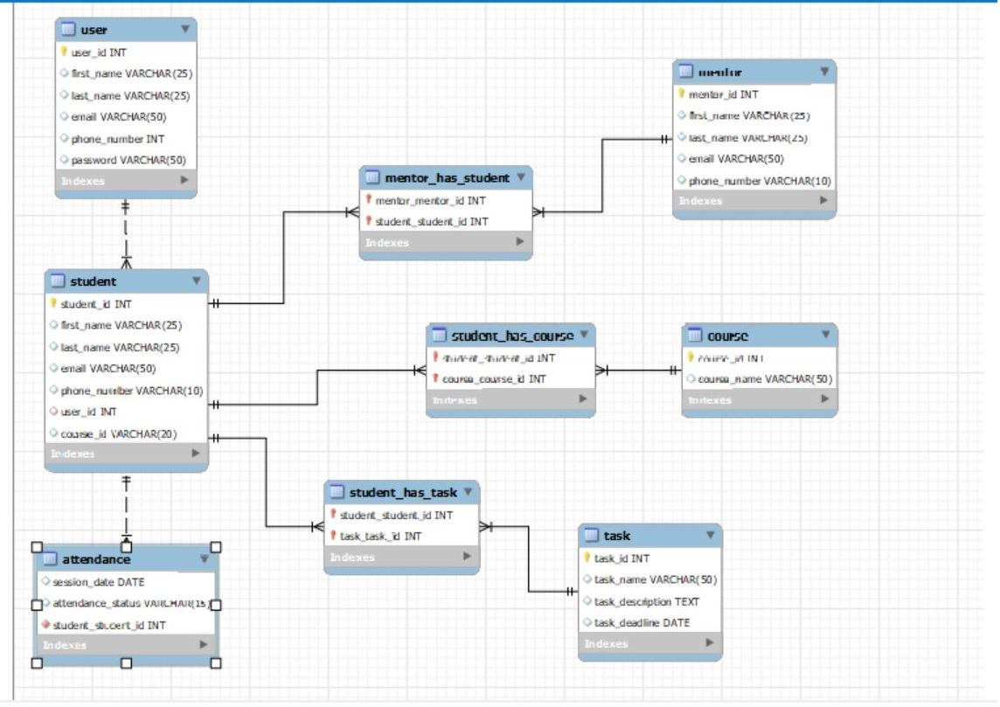

# DB Model Design for GUVI ZEN Class

This repository is for database architectural model for GUVI Zen Class. GUVI Zen class having the following tables and the below ER (Entity - Relationship) diagram shows the relationship between each tables in the database.

Database Name: GUVI-ZEN
 
TABLES:  
User  	
Student	 
Mentor	 
Course	 
Task	 
Attendence
 
## Entity-Relationship(E-R) Diagram

 

### <h2 align="left">Programming Language Used :</h2>

  
  
  

------